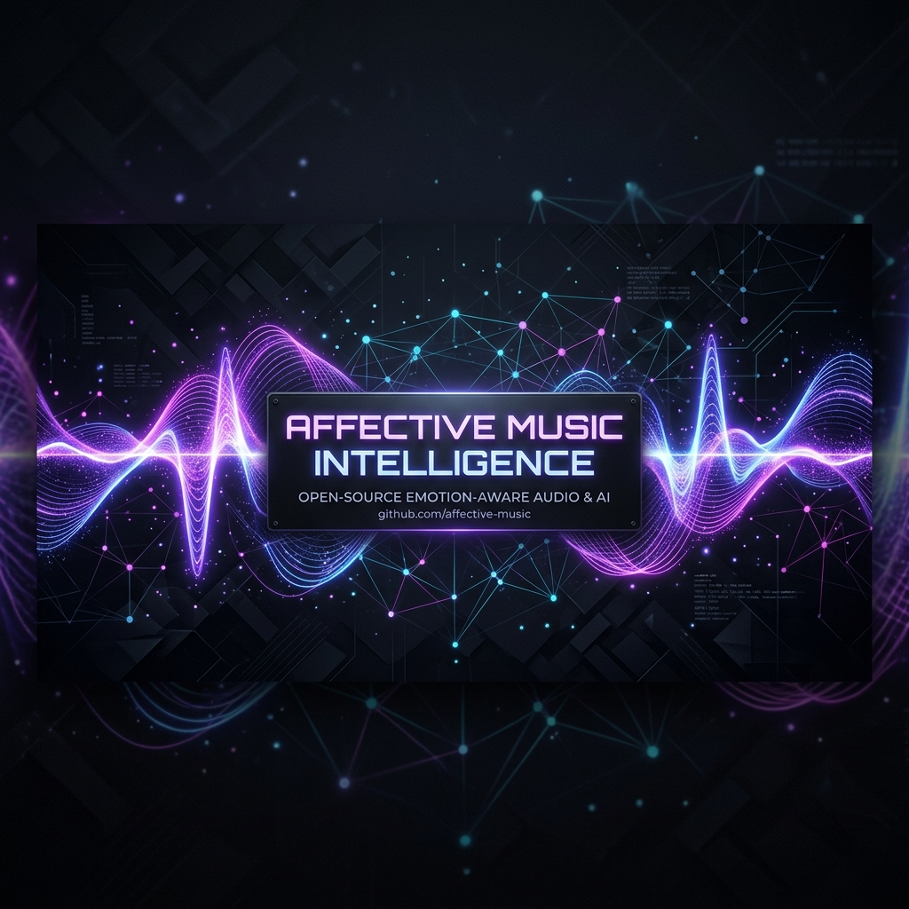

<div align="center">
  
  

  <h1>🎵 Affective Music Intelligence</h1>
  
    <strong>A high-performance, full-stack application that analyzes your music listening history using offline PyTorch Machine Learning and the Gemini API to visualize your auditory emotional journey.</strong>
  </p>

  <p>
    <a href="#features"><strong>Features</strong></a> ·
    <a href="#tech-stack"><strong>Tech Stack</strong></a> ·
    <a href="#quick-start"><strong>Quick Start</strong></a> ·
    <a href="#contributing-up-for-grabs"><strong>Contributing</strong></a>
  </p>

  <p>
    
    
    
    
    
  </p>
</div>

<br/>

## 🎯 Our Goal (And How We Built It For $0)

The ultimate goal of this project is to create an enterprise-grade music analytics platform that feels like magic—all without spending a dime (yet). 
We managed to make it live with **0 cost for now** by utilizing a creative hybrid architecture:
- **Free-Tier Database**: Leveraging TiDB Serverless for zero-cost distributed SQL.
- **Free-Tier Backend**: Hosting the FastAPI backend on free cloud tiers (like Render).
- **Local Heavy Lifting**: Offloading the insanely expensive GPU inference (PyTorch Mel-Spectrograms, Madmom) completely to local hardware via our custom ML Worker.

**The Future 🔮**: In the future, once we secure funding (or I just decide to open my wallet), we would absolutely want to make this live natively with **Oracle Cloud** and stuff like that to scale the ML engine to the cloud for real-time, zero-configuration processing.

## 😅 A Note from the Creator

Look, I am a completely new developer and this project is basically a giant sandbox for me to learn full-stack development, ML, and how to not break production. 

So please... feel free to criticize my dumb mistakes. Seriously. If you see code that looks like it was written by a caffeinated squirrel slamming its head on a keyboard, *call it out*. Submit an issue, laugh at my `console.log("here 1")` statements that I definitely forgot to remove, and help me learn. 

<br/>

## ✨ Features

- 🧠 **Offline ML Audio Analysis**: Downloads raw audio files and extracts **Mel-Spectrograms**, **BPM**, and **Rhythm Regularity** using state-of-the-art `PyTorch` models and `Madmom` RNNs completely locally on your hardware.
- ⚡ **Multi-Threaded Worker**: Utilizes `asyncio` and custom ThreadPools to saturate 100% of CPU/GPU capacity for high-throughput batch analysis.
- 🤖 **Gemini API Integration**: Uses `google-genai` to analyze deep semantic themes, musical valence, and arousal to score the mood of your music.
- 📊 **Cinematic Dashboard**: A premium Next.js frontend built with TailwindCSS, featuring glassmorphism, Recharts graphs, and custom typography to visualize your mood trends over time.
- 🗄️ **Distributed Database**: Powered by TiDB (Cloud MySQL) with Prisma ORM for high-availability synchronization.

## 🛠️ Tech Stack

| Domain | Technologies |
| ------ | ------------ |
| **Frontend** | React, Next.js (App Router), TailwindCSS, Recharts, Framer Motion |
| **Backend** | Python, FastAPI, SQLAlchemy, Uvicorn |
| **ML Engine** | PyTorch, Torchaudio, Librosa, Madmom, yt-dlp, Google GenAI |
| **Database** | TiDB Cloud, MySQL, Prisma ORM |

<br/>

---

## 🚀 Quick Start

Due to the complex nature of this full-stack application, running it requires initializing three separate environments.

### 1. Database & Backend (FastAPI)
Navigate to the `backend` directory and set up your Python environment:
```bash
cd backend
python -m venv .venv
source .venv/Scripts/activate  # Or .venv/bin/activate on Mac/Linux
pip install -r requirements.txt
```
*Create a `.env` file in the backend directory containing your TiDB credentials (`DATABASE_URL`).*
```bash
uvicorn main:app --reload --port 8000
```

### 2. Machine Learning Engine
In a new terminal, navigate to the `ml_engine` directory. This requires `uv` for fast dependency resolution due to large ML binaries:
```bash
cd ml_engine
uv venv
uv pip install -r requirements.txt
```
*Create a `.env` file here with your `GEMINI_API_KEY` and `CLOUD_API_URL`.*
```bash
# Start the background ML worker
uv run local_worker.py
```

### 3. Frontend (Next.js)
In a third terminal, start the UI:
```bash
cd frontend
npm install
npm run dev
```
Navigate to `http://localhost:3000` to view the dashboard!

<br/>

---

## 🤝 Contributing (Up For Grabs!)

We are currently looking for open-source contributors! Whether you are a Junior Developer looking for your first PR, or a Senior ML Engineer, there is a place for you here.

Look for issues tagged with **`good first issue`** or **`up-for-grabs`** on our GitHub Issues page.

### Areas we need help with:
- 🎨 **Frontend/CSS**: We want to make the dashboard even more cinematic. Adding micro-animations, better hover states, and responsive mobile layouts.
- ⚙️ **ML Engine**: Optimizing the PyTorch GPU tensors, caching HuggingFace models, or improving the heuristic fallback logic.
- 🧪 **Testing**: Adding `pytest` tests for the FastAPI routes and `Jest` tests for the React components.

### How to Contribute
1. **Fork** the repository
2. Create a **Feature Branch** (`git checkout -b feature/amazing-feature`)
3. **Commit** your changes (`git commit -m 'Add some amazing feature'`)
4. **Push** to the branch (`git push origin feature/amazing-feature`)
5. Open a **Pull Request**!

<div align="center">
  <br/>
  <i>Built with ❤️ for Music & Data Lovers</i>
</div>
